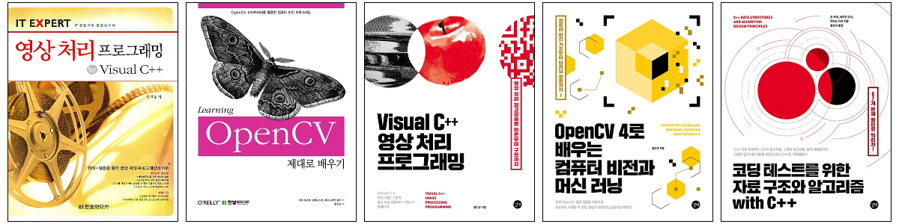

## Resume

* ~ 2006년 8월: [한양대학교](https://www.hanyang.ac.kr/){:target="_blank"} 공학박사 (영상 처리 전공)
* ~ 2007년 11월: 뉴질랜드 캔터베리 대학교 [HIT Lab NZ](https://www.hitlabnz.org/){:target="_blank"} Postdoctoral Fellow
* ~ 2009년 3월: 한양대학교 연구교수
* ~ 2016년 3월: LG전자 MC연구소 책임연구원 (안드로이드 카메라 프레임워크 및 신기능 개발)
* 2016년 9월~<현재>: IT 강사, IT 저자, 프리랜서 개발자

## Favorite Proverb

* 易地思之, 他山之石, 中庸之德
* 知之爲知之 不知爲不知 是知也

## Books

* 영상 처리 프로그래밍 by Visual C++ (한빛미디어, 2007)
* OpenCV 제대로 배우기 (한빛미디어, 2009, 번역서)
* [Visual C++ 영상 처리 프로그래밍](https://github.com/sunkyoo/ippbook_vs2015){:target="_blank"} (길벗, 2015) / [[YES24]](http://www.yes24.com/Product/goods/23512691){:target="_blank"} [[길벗]](https://www.gilbut.co.kr/book/view?bookcode=BN001382){:target="_blank"}
* [OpenCV 4로 배우는 컴퓨터 비전과 머신 러닝](https://sunkyoo.github.io/opencv4cvml/){:target="_blank"} (길벗, 2019) / [[YES24]](http://www.yes24.com/Product/Goods/71829618){:target="_blank"} [[길벗]](https://www.gilbut.co.kr/book/view?bookcode=BN002402){:target="_blank"}
* [코딩 테스트를 위한 자료 구조와 알고리즘 with C++](https://github.com/sunkyoo/CPP-Data-Structures-and-Algorithms){:target="_blank"} (길벗, 2020) / [[YES24]](http://www.yes24.com/Product/Goods/95863013){:target="_blank"} [[길벗]](https://www.gilbut.co.kr/book/view?bookcode=BN002938){:target="_blank"}

## Lectures/Seminars/Projects

* [패스트캠퍼스](https://www.fastcampus.co.kr/){:target="_blank"} 강의
  * [[OpenCV C++로 배우는 컴퓨터 비전 프로그래밍 캠프]](https://www.fastcampus.co.kr/dev_camp_cvocv/){:target="_blank"}
    * 2016년 9월 ~ 2021년 12월

  * [[파이썬과 OpenCV로 배우는 컴퓨터 비전 프로그래밍 캠프]](https://www.fastcampus.co.kr/dev_camp_pyocv/){:target="_blank"}
    * 2020년 1월 ~ 2월

  * [[OpenCV를 활용한 컴퓨터 비전과 딥러닝 올인원 패키지 Online](온라인 강의)](https://www.fastcampus.co.kr/dev_online_cvodl){:target="_blank"}
    * 2020년 6월 ~ 2024년 3월

* [프로그래머스](https://programmers.co.kr/){:target="_blank"} 강의

  * [[코딩테스트와 실무 역량 모두 잡는 알고리즘 스터디(C++반)]](https://programmers.co.kr/learn/courses/10476/){:target="_blank"}
    * 2020년 7월 ~ 2021년 3월

  * [[C++] 어서와! 자료구조와 알고리즘은 처음이지?(온라인 강의)](https://programmers.co.kr/learn/courses/13007){:target="_blank"}
    * 2021년 10월 ~ <현재>

  * [프로그래머스 데브코스 자율주행 中 OpenCV 강의](https://school.programmers.co.kr/learn/courses/17916){:target="_blank"}
    * 2022년 4월 ~ <현재>

* 기업체/대학 강의
  * (주) 고영테크놀로지, "OpenCV 프로그래밍" (2017년 5월)
  * 국민대학교 자동차융합대학 & 소프트웨어융합대학 특강, "OpenCV 프로그래밍" (2017년 8월)
  * (주) 기가비스, "OpenCV 프로그래밍" (2017년 10월)
  * (주) 삼성전자, "해외 법인 로봇 비전 초청" 교육 (2018년 3월)
  * (주) 골프존, "OpenCV 프로그래밍" (2018년 6월)
  * (주) 삼성전자, "비전 알고리즘 기초 & 심화" (2019년 5, 10, 11월)
  * (주) 엠빛, "최신 OpenCV 라이브러리 특징과 활용 방안" (2019년 6월)
  * (주) 삼성디스플레이, Machine Vision 특강, "How to Use OpenCV" (2019년 10월)
  * 서원대학교 특강, "OpenCV와 딥러닝 활용" (2019년 11월)
  * (주) 현대모비스, "Data Structure & Algorithm (Coding Test)" (2019년 12월)
  * (주) 대우조선해양, "스마트쉽 전문가 양성 과정" (2020년 12월)
  * (주) 현대모비스, "Data Structure & Algorithm (Coding Test)" (2022년 1월)
  * (주) LG전자, "OpenCV C++로배우는컴퓨터비전프로그래밍" (2022년 4월)
  * 인천대학교 특강, "OpenCV를 통한 비전인식 및 처리" (2023년 8월)
* 세미나
  * 한국미래기술교육연구원 (2019년 1월)
    * "인공지능의 눈" - 비전 AI의 모든 것컴퓨터비전 기반의 영상인식 기반기술과 솔루션 개발방안
    * Title: "최신 OpenCV 라이브러리 특징과 활용 방안" [[관련기사]](http://www.kidd.co.kr/news/206743){:target="_blank"}
  * T아카데미 (2020년 5월)
    * 토크ON세미나
    * Title: "파이썬 OpenCV 프로그래밍 입문과 활용"
* 프로젝트
  * (주) 기가비스, "불특정 영상의 반복주기 패턴인식 프로젝트" (2019년 2월)
  * 한국철도기술연구원, "Alvium SDK 기반 절연상태 분석을 위한 데이터구축용 영상처리 프로그램 코딩" (2023년 8월)

## Selected Papers

* S. K. Hwang, Mark Billinghurst, and Whoi-Yul Kim, "Local Descriptor by Zernike Moments for Real-time Keypoint Matching," International Congress on Image and Signal Processing (CISP2008), pp.781-785, May 2008.
* S. K. Hwang and W. Y. Kim, "A Novel Approach to the Fast Computation of Zernike Moments," Pattern Recognition, vol. 39, no. 11, pp. 2065-2076, Nov. 2006. (SCI)
* S. K. Hwang and W. Y. Kim, "Fast and efficient method for computing ART," IEEE Trans. Image Processing, vol. 15, no. 1, pp. 112-117, Jan. 2006. (SCI)
* S. K. Hwang and W. Y. Kim, "Motion Field Refinement and Region-Based Motion Segmentation," Lecture Notes in Computer Science, vol. 3767, pp. 280-290, Nov. 2005. (SCIE)
